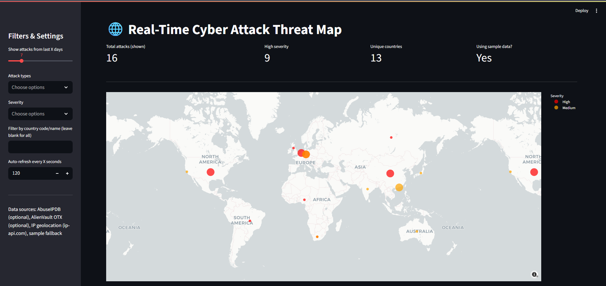
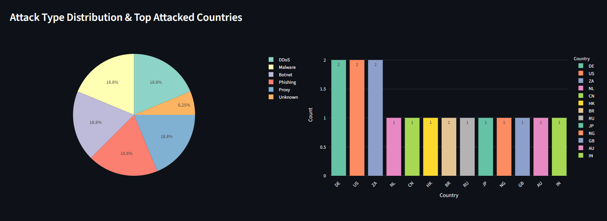
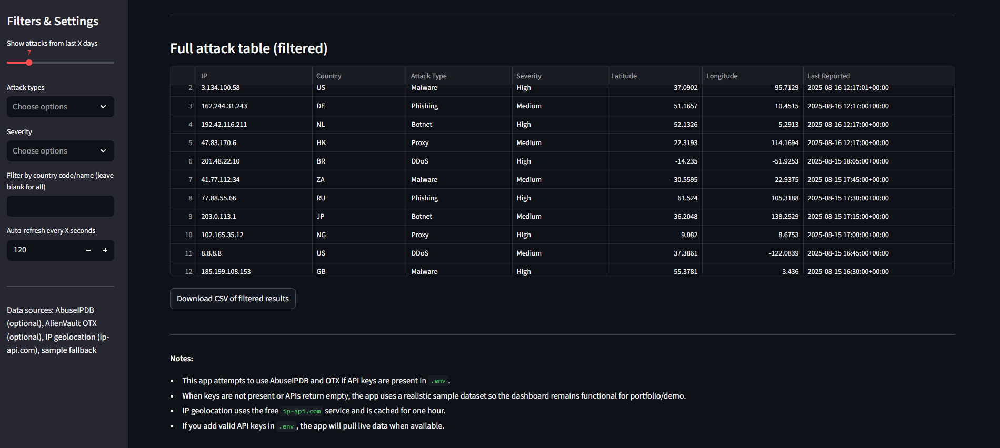

# Real-Time Cyber Threat Map

This project is a Streamlit dashboard that visualizes real-time (or sample) cyber threat data on a world map, with interactive charts and filters.

## Features
- Live or sample data from AbuseIPDB and AlienVault OTX (API keys optional)
- IP geolocation using ip-api.com
- Interactive map of attack sources
- Attack type and country distribution charts
- Filtering by time, attack type, severity, and country
- Downloadable filtered results as CSV
- Auto-refresh support

## Getting Started

### Prerequisites
- Python 3.8+
- pip

### Installation
1. Clone this repository or copy the files to your project directory.
2. Install dependencies:
   ```bash
   pip install streamlit pandas plotly python-dotenv streamlit-autorefresh requests pytz
   ```
3. (Optional) Add your API keys to a `.env` file:
   ```env
   ABUSEIPDB_API_KEY=your_abuseipdb_key
   OTX_API_KEY=your_otx_key
   ```

### Running the App
```bash
streamlit run app.py
```
### Live Demo
https://threatmap1449.streamlit.app/
## Sample Data
If no API keys are provided or APIs return no data, the app uses a diverse sample dataset with various attack types, countries, and severities for demonstration.

## Screenshots



## Notes
- The app is for demonstration and educational purposes.
- Geolocation is approximate and uses a free service.
- For live data, valid API keys are required.

## License
MIT License
